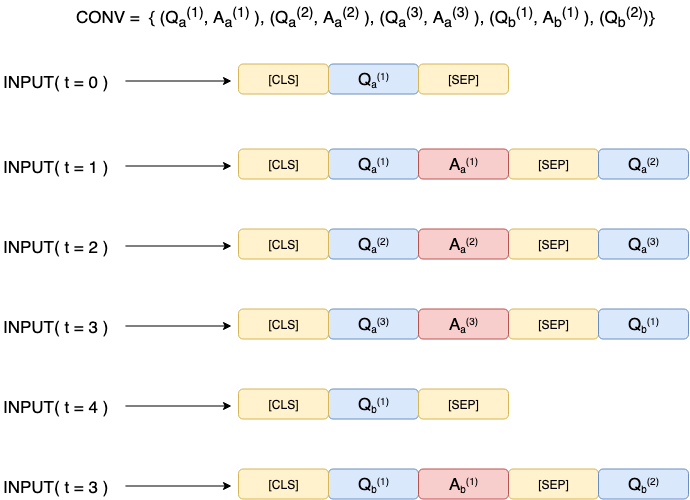
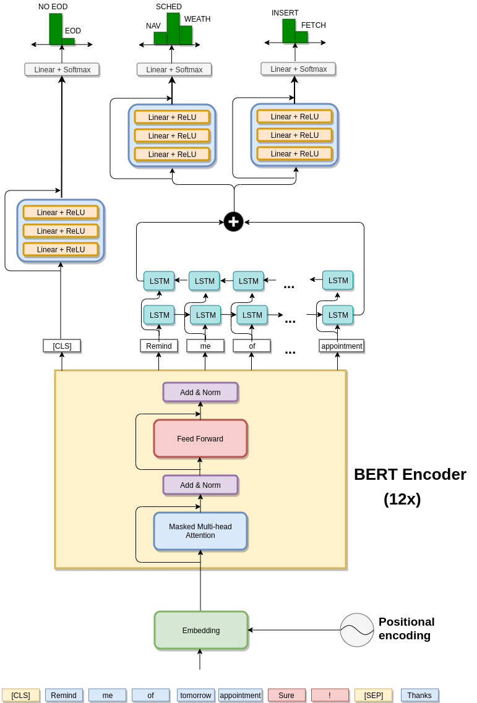
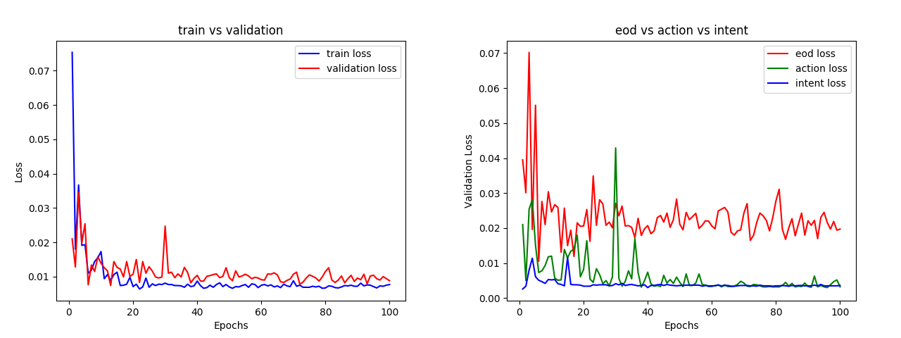

# Повторение эксперимента

### Команды для повторения

Настройка окружения:
```bash
virtualenv .env --python=python3
. .env/bin/activate
pip install -r requirements.txt
```

Запуск обучения и тестирования:
```bash
python train.py 100
ll savings/
python test.py savings/<...>/state_dict.pt
```

### Логи запуска
```bash
andresokol@andresokol-sas:~/MTSI-BERT [master|~]$ . .env/bin/activate
(.env) andresokol@andresokol-sas:~/MTSI-BERT [master|?1]$ python train.py 100
Training 100 epochs
active device = cpu
### EPOCH 1/100 (bert_lr=5e-05, nn_lr=0.001):: TRAIN LOSS = 0.783[eos = 0.7475], [action = 0.489], [intent = 1.1125], 
                         || VAL LOSS = 0.7789[eos = 0.7313], [action = 0.4977], [intent = 1.1076]
### EPOCH 2/100 (bert_lr=5e-05, nn_lr=0.001):: TRAIN LOSS = 0.7634[eos = 0.7218], [action = 0.4677], [intent = 1.1006], 
                         || VAL LOSS = 0.7829[eos = 0.7393], [action = 0.5117], [intent = 1.0977]
### EPOCH 3/100 (bert_lr=5e-05, nn_lr=0.001):: TRAIN LOSS = 0.7642[eos = 0.7243], [action = 0.4683], [intent = 1.0999], 
                         || VAL LOSS = 0.7858[eos = 0.7297], [action = 0.5277], [intent = 1.1]
### EPOCH 4/100 (bert_lr=5e-05, nn_lr=0.001):: TRAIN LOSS = 0.7601[eos = 0.7186], [action = 0.4608], [intent = 1.1008], 
                         || VAL LOSS = 0.7819[eos = 0.7346], [action = 0.5088], [intent = 1.1023]
### EPOCH 5/100 (bert_lr=5e-05, nn_lr=0.001):: TRAIN LOSS = 0.7629[eos = 0.7188], [action = 0.4691], [intent = 1.1007], 
                         || VAL LOSS = 0.7789[eos = 0.7273], [action = 0.5132], [intent = 1.0963]
### EPOCH 6/100 (bert_lr=2.5e-05, nn_lr=0.0005):: TRAIN LOSS = 0.7595[eos = 0.7179], [action = 0.4609], [intent = 1.0997], 
                         || VAL LOSS = 0.7748[eos = 0.7149], [action = 0.51], [intent = 1.0994]
### EPOCH 7/100 (bert_lr=2.5e-05, nn_lr=0.0005):: TRAIN LOSS = 0.7598[eos = 0.7123], [action = 0.468], [intent = 1.099], 
                         || VAL LOSS = 0.769[eos = 0.7156], [action = 0.4927], [intent = 1.0988]
### EPOCH 8/100 (bert_lr=2.5e-05, nn_lr=0.0005):: TRAIN LOSS = 0.7556[eos = 0.7063], [action = 0.4622], [intent = 1.0984], 
                         || VAL LOSS = 0.7693[eos = 0.7067], [action = 0.504], [intent = 1.0972]
### EPOCH 9/100 (bert_lr=2.5e-05, nn_lr=0.0005):: TRAIN LOSS = 0.7564[eos = 0.7107], [action = 0.4595], [intent = 1.0989], 
                         || VAL LOSS = 0.7764[eos = 0.7113], [action = 0.5196], [intent = 1.0983]
### EPOCH 10/100 (bert_lr=2.5e-05, nn_lr=0.0005):: TRAIN LOSS = 0.7563[eos = 0.7077], [action = 0.462], [intent = 1.0991], 
                         || VAL LOSS = 0.7733[eos = 0.7151], [action = 0.5072], [intent = 1.0977]
### EPOCH 11/100 (bert_lr=1.25e-05, nn_lr=0.00025):: TRAIN LOSS = 0.7544[eos = 0.7057], [action = 0.4597], [intent = 1.0979], 
                         || VAL LOSS = 0.7654[eos = 0.7016], [action = 0.496], [intent = 1.0986]
### EPOCH 12/100 (bert_lr=1.25e-05, nn_lr=0.00025):: TRAIN LOSS = 0.7543[eos = 0.7028], [action = 0.4613], [intent = 1.0987], 
                         || VAL LOSS = 0.7657[eos = 0.6988], [action = 0.5008], [intent = 1.0975]
### EPOCH 13/100 (bert_lr=1.25e-05, nn_lr=0.00025):: TRAIN LOSS = 0.7523[eos = 0.7022], [action = 0.4557], [intent = 1.0991], 
                         || VAL LOSS = 0.7692[eos = 0.7067], [action = 0.5027], [intent = 1.0981]
### EPOCH 14/100 (bert_lr=1.25e-05, nn_lr=0.00025):: TRAIN LOSS = 0.7526[eos = 0.7018], [action = 0.4573], [intent = 1.0988], 
                         || VAL LOSS = 0.7657[eos = 0.6978], [action = 0.5008], [intent = 1.0985]
### EPOCH 15/100 (bert_lr=1.25e-05, nn_lr=0.00025):: TRAIN LOSS = 0.7522[eos = 0.6996], [action = 0.4583], [intent = 1.0987], 
                         || VAL LOSS = 0.7667[eos = 0.6983], [action = 0.5034], [intent = 1.0985]
### EPOCH 16/100 (bert_lr=6.25e-06, nn_lr=0.000125):: TRAIN LOSS = 0.7513[eos = 0.6975], [action = 0.4579], [intent = 1.0986], 
                         || VAL LOSS = 0.7673[eos = 0.6995], [action = 0.5043], [intent = 1.0982]
### EPOCH 17/100 (bert_lr=6.25e-06, nn_lr=0.000125):: TRAIN LOSS = 0.7511[eos = 0.6999], [action = 0.4548], [intent = 1.0986], 
                         || VAL LOSS = 0.764[eos = 0.7], [action = 0.4935], [intent = 1.0985]
### EPOCH 18/100 (bert_lr=6.25e-06, nn_lr=0.000125):: TRAIN LOSS = 0.7514[eos = 0.6987], [action = 0.4569], [intent = 1.0986], 
                         || VAL LOSS = 0.7664[eos = 0.6999], [action = 0.5006], [intent = 1.0986]
### EPOCH 19/100 (bert_lr=6.25e-06, nn_lr=0.000125):: TRAIN LOSS = 0.7517[eos = 0.6988], [action = 0.4577], [intent = 1.0986], 
                         || VAL LOSS = 0.7659[eos = 0.6961], [action = 0.5032], [intent = 1.0985]
### EPOCH 20/100 (bert_lr=6.25e-06, nn_lr=0.000125):: TRAIN LOSS = 0.7505[eos = 0.6973], [action = 0.4557], [intent = 1.0986], 
                         || VAL LOSS = 0.7667[eos = 0.696], [action = 0.5059], [intent = 1.0981]
### EPOCH 21/100 (bert_lr=3.125e-06, nn_lr=6.25e-05):: TRAIN LOSS = 0.7499[eos = 0.6957], [action = 0.4553], [intent = 1.0986], 
                         || VAL LOSS = 0.7646[eos = 0.6972], [action = 0.4982], [intent = 1.0985]
### EPOCH 22/100 (bert_lr=3.125e-06, nn_lr=6.25e-05):: TRAIN LOSS = 0.7504[eos = 0.6976], [action = 0.455], [intent = 1.0985], 
                         || VAL LOSS = 0.7669[eos = 0.6973], [action = 0.5051], [intent = 1.0984]
### EPOCH 23/100 (bert_lr=3.125e-06, nn_lr=6.25e-05):: TRAIN LOSS = 0.7504[eos = 0.6957], [action = 0.4571], [intent = 1.0985], 
                         || VAL LOSS = 0.7652[eos = 0.6936], [action = 0.5035], [intent = 1.0985]
### EPOCH 24/100 (bert_lr=3.125e-06, nn_lr=6.25e-05):: TRAIN LOSS = 0.75[eos = 0.6964], [action = 0.4551], [intent = 1.0986], 
                         || VAL LOSS = 0.7649[eos = 0.6988], [action = 0.4975], [intent = 1.0985]
### EPOCH 25/100 (bert_lr=3.125e-06, nn_lr=6.25e-05):: TRAIN LOSS = 0.7502[eos = 0.6959], [action = 0.4561], [intent = 1.0986], 
                         || VAL LOSS = 0.7627[eos = 0.6957], [action = 0.4941], [intent = 1.0982]
### EPOCH 26/100 (bert_lr=3.125e-06, nn_lr=6.25e-05):: TRAIN LOSS = 0.7504[eos = 0.697], [action = 0.4555], [intent = 1.0986], 
                         || VAL LOSS = 0.7654[eos = 0.6968], [action = 0.5009], [intent = 1.0986]
### EPOCH 27/100 (bert_lr=3.125e-06, nn_lr=6.25e-05):: TRAIN LOSS = 0.75[eos = 0.6957], [action = 0.4558], [intent = 1.0985], 
                         || VAL LOSS = 0.7666[eos = 0.6981], [action = 0.5034], [intent = 1.0984]
### EPOCH 28/100 (bert_lr=3.125e-06, nn_lr=6.25e-05):: TRAIN LOSS = 0.7508[eos = 0.6974], [action = 0.4563], [intent = 1.0986], 
                         || VAL LOSS = 0.764[eos = 0.6951], [action = 0.4983], [intent = 1.0985]
### EPOCH 29/100 (bert_lr=3.125e-06, nn_lr=6.25e-05):: TRAIN LOSS = 0.75[eos = 0.6958], [action = 0.4555], [intent = 1.0986], 
                         || VAL LOSS = 0.7644[eos = 0.6908], [action = 0.5039], [intent = 1.0985]
### EPOCH 30/100 (bert_lr=3.125e-06, nn_lr=6.25e-05):: TRAIN LOSS = 0.7498[eos = 0.6949], [action = 0.4559], [intent = 1.0986], 
                         || VAL LOSS = 0.7651[eos = 0.6958], [action = 0.5012], [intent = 1.0983]
### EPOCH 31/100 (bert_lr=1.5625e-06, nn_lr=3.125e-05):: TRAIN LOSS = 0.7499[eos = 0.6954], [action = 0.4558], [intent = 1.0986],
                         || VAL LOSS = 0.764[eos = 0.6922], [action = 0.5013], [intent = 1.0984]
### EPOCH 32/100 (bert_lr=1.5625e-06, nn_lr=3.125e-05):: TRAIN LOSS = 0.7498[eos = 0.6954], [action = 0.4554], [intent = 1.0985], 
                         || VAL LOSS = 0.7661[eos = 0.6971], [action = 0.5028], [intent = 1.0984]
### EPOCH 33/100 (bert_lr=1.5625e-06, nn_lr=3.125e-05):: TRAIN LOSS = 0.7494[eos = 0.6949], [action = 0.4548], [intent = 1.0985], 
                         || VAL LOSS = 0.7641[eos = 0.6953], [action = 0.4985], [intent = 1.0985]
### EPOCH 34/100 (bert_lr=1.5625e-06, nn_lr=3.125e-05):: TRAIN LOSS = 0.7499[eos = 0.6951], [action = 0.4559], [intent = 1.0986], 
                         || VAL LOSS = 0.7644[eos = 0.6961], [action = 0.4988], [intent = 1.0984]
### EPOCH 35/100 (bert_lr=1.5625e-06, nn_lr=3.125e-05):: TRAIN LOSS = 0.7496[eos = 0.6953], [action = 0.4549], [intent = 1.0985], 
                         || VAL LOSS = 0.7666[eos = 0.6979], [action = 0.5033], [intent = 1.0985]
### EPOCH 36/100 (bert_lr=1.5625e-06, nn_lr=3.125e-05):: TRAIN LOSS = 0.75[eos = 0.6952], [action = 0.4561], [intent = 1.0986], 
                         || VAL LOSS = 0.7646[eos = 0.6944], [action = 0.501], [intent = 1.0984]
### EPOCH 37/100 (bert_lr=1.5625e-06, nn_lr=3.125e-05):: TRAIN LOSS = 0.7491[eos = 0.6933], [action = 0.4555], [intent = 1.0985], 
                         || VAL LOSS = 0.7641[eos = 0.6924], [action = 0.5016], [intent = 1.0984]
### EPOCH 38/100 (bert_lr=1.5625e-06, nn_lr=3.125e-05):: TRAIN LOSS = 0.7496[eos = 0.6945], [action = 0.4558], [intent = 1.0985], 
                         || VAL LOSS = 0.7652[eos = 0.6926], [action = 0.5047], [intent = 1.0984]
### EPOCH 39/100 (bert_lr=1.5625e-06, nn_lr=3.125e-05):: TRAIN LOSS = 0.7497[eos = 0.6962], [action = 0.4545], [intent = 1.0985], 
                         || VAL LOSS = 0.7639[eos = 0.6915], [action = 0.5016], [intent = 1.0985]
### EPOCH 40/100 (bert_lr=1.5625e-06, nn_lr=3.125e-05):: TRAIN LOSS = 0.7493[eos = 0.6943], [action = 0.4551], [intent = 1.0985], 
                         || VAL LOSS = 0.7646[eos = 0.693], [action = 0.5022], [intent = 1.0985]
### EPOCH 41/100 (bert_lr=7.8125e-07, nn_lr=1.5625e-05):: TRAIN LOSS = 0.7487[eos = 0.6937], [action = 0.454], [intent = 1.0985], 
                         || VAL LOSS = 0.7652[eos = 0.6957], [action = 0.5014], [intent = 1.0985]
### EPOCH 42/100 (bert_lr=7.8125e-07, nn_lr=1.5625e-05):: TRAIN LOSS = 0.7497[eos = 0.6941], [action = 0.4564], [intent = 1.0985], 
                         || VAL LOSS = 0.7646[eos = 0.6957], [action = 0.4996], [intent = 1.0985]
### EPOCH 43/100 (bert_lr=7.8125e-07, nn_lr=1.5625e-05):: TRAIN LOSS = 0.7494[eos = 0.6941], [action = 0.4555], [intent = 1.0985], 
                         || VAL LOSS = 0.7642[eos = 0.6942], [action = 0.5], [intent = 1.0984]
### EPOCH 44/100 (bert_lr=7.8125e-07, nn_lr=1.5625e-05):: TRAIN LOSS = 0.7491[eos = 0.6945], [action = 0.4542], [intent = 1.0985], 
                         || VAL LOSS = 0.7637[eos = 0.6933], [action = 0.4994], [intent = 1.0985]
### EPOCH 45/100 (bert_lr=7.8125e-07, nn_lr=1.5625e-05):: TRAIN LOSS = 0.7493[eos = 0.6938], [action = 0.4557], [intent = 1.0985], 
                         || VAL LOSS = 0.7662[eos = 0.6965], [action = 0.5036], [intent = 1.0985]
### EPOCH 46/100 (bert_lr=7.8125e-07, nn_lr=1.5625e-05):: TRAIN LOSS = 0.7497[eos = 0.6946], [action = 0.456], [intent = 1.0985], 
                         || VAL LOSS = 0.7634[eos = 0.693], [action = 0.4987], [intent = 1.0985]
### EPOCH 47/100 (bert_lr=7.8125e-07, nn_lr=1.5625e-05):: TRAIN LOSS = 0.7494[eos = 0.6942], [action = 0.4555], [intent = 1.0985], 
                         || VAL LOSS = 0.7652[eos = 0.6936], [action = 0.5036], [intent = 1.0985]
### EPOCH 48/100 (bert_lr=7.8125e-07, nn_lr=1.5625e-05):: TRAIN LOSS = 0.749[eos = 0.6936], [action = 0.455], [intent = 1.0985], 
                         || VAL LOSS = 0.7653[eos = 0.6952], [action = 0.5022], [intent = 1.0985]
### EPOCH 49/100 (bert_lr=7.8125e-07, nn_lr=1.5625e-05):: TRAIN LOSS = 0.7491[eos = 0.6949], [action = 0.4539], [intent = 1.0985], 
                         || VAL LOSS = 0.7637[eos = 0.6935], [action = 0.4993], [intent = 1.0984]
### EPOCH 50/100 (bert_lr=7.8125e-07, nn_lr=1.5625e-05):: TRAIN LOSS = 0.7495[eos = 0.6956], [action = 0.4545], [intent = 1.0985], 
                         || VAL LOSS = 0.7653[eos = 0.6939], [action = 0.5035], [intent = 1.0984]
### EPOCH 51/100 (bert_lr=3.90625e-07, nn_lr=7.8125e-06):: TRAIN LOSS = 0.7498[eos = 0.6955], [action = 0.4553], [intent = 1.0985], 
                         || VAL LOSS = 0.7658[eos = 0.6957], [action = 0.5033], [intent = 1.0985]
### EPOCH 52/100 (bert_lr=3.90625e-07, nn_lr=7.8125e-06):: TRAIN LOSS = 0.7494[eos = 0.6944], [action = 0.4552], [intent = 1.0985], 
                         || VAL LOSS = 0.7649[eos = 0.6935], [action = 0.5028], [intent = 1.0985]
### EPOCH 53/100 (bert_lr=3.90625e-07, nn_lr=7.8125e-06):: TRAIN LOSS = 0.7494[eos = 0.6934], [action = 0.4562], [intent = 1.0985], 
                         || VAL LOSS = 0.766[eos = 0.6975], [action = 0.5019], [intent = 1.0985]
### EPOCH 54/100 (bert_lr=3.90625e-07, nn_lr=7.8125e-06):: TRAIN LOSS = 0.7494[eos = 0.6946], [action = 0.4551], [intent = 1.0985], 
                         || VAL LOSS = 0.7646[eos = 0.6934], [action = 0.502], [intent = 1.0985]
### EPOCH 55/100 (bert_lr=3.90625e-07, nn_lr=7.8125e-06):: TRAIN LOSS = 0.7489[eos = 0.6937], [action = 0.4545], [intent = 1.0985], 
                         || VAL LOSS = 0.764[eos = 0.6918], [action = 0.5018], [intent = 1.0985]
### EPOCH 56/100 (bert_lr=3.90625e-07, nn_lr=7.8125e-06):: TRAIN LOSS = 0.7489[eos = 0.6938], [action = 0.4545], [intent = 1.0985], 
                         || VAL LOSS = 0.7651[eos = 0.694], [action = 0.5029], [intent = 1.0984]
### EPOCH 57/100 (bert_lr=3.90625e-07, nn_lr=7.8125e-06):: TRAIN LOSS = 0.749[eos = 0.694], [action = 0.4546], [intent = 1.0985], 
                         || VAL LOSS = 0.7649[eos = 0.6953], [action = 0.501], [intent = 1.0984]
### EPOCH 58/100 (bert_lr=3.90625e-07, nn_lr=7.8125e-06):: TRAIN LOSS = 0.7488[eos = 0.6928], [action = 0.455], [intent = 1.0985], 
                         || VAL LOSS = 0.7642[eos = 0.6927], [action = 0.5015], [intent = 1.0985]
### EPOCH 59/100 (bert_lr=3.90625e-07, nn_lr=7.8125e-06):: TRAIN LOSS = 0.7492[eos = 0.6943], [action = 0.4549], [intent = 1.0985], 
                         || VAL LOSS = 0.7649[eos = 0.6938], [action = 0.5023], [intent = 1.0985]
### EPOCH 60/100 (bert_lr=3.90625e-07, nn_lr=7.8125e-06):: TRAIN LOSS = 0.7489[eos = 0.6931], [action = 0.455], [intent = 1.0985], 
                         || VAL LOSS = 0.764[eos = 0.6928], [action = 0.5006], [intent = 1.0985]
### EPOCH 61/100 (bert_lr=3.90625e-07, nn_lr=7.8125e-06):: TRAIN LOSS = 0.7491[eos = 0.6942], [action = 0.4546], [intent = 1.0985], 
                         || VAL LOSS = 0.7632[eos = 0.691], [action = 0.5], [intent = 1.0985]
### EPOCH 62/100 (bert_lr=3.90625e-07, nn_lr=7.8125e-06):: TRAIN LOSS = 0.7496[eos = 0.694], [action = 0.4563], [intent = 1.0985], 
                         || VAL LOSS = 0.7653[eos = 0.6947], [action = 0.5027], [intent = 1.0984]
### EPOCH 63/100 (bert_lr=3.90625e-07, nn_lr=7.8125e-06):: TRAIN LOSS = 0.7491[eos = 0.6938], [action = 0.4551], [intent = 1.0985], 
                         || VAL LOSS = 0.7659[eos = 0.6973], [action = 0.5018], [intent = 1.0985]
### EPOCH 64/100 (bert_lr=3.90625e-07, nn_lr=7.8125e-06):: TRAIN LOSS = 0.7489[eos = 0.6933], [action = 0.4548], [intent = 1.0985], 
                         || VAL LOSS = 0.7633[eos = 0.6925], [action = 0.4988], [intent = 1.0985]
### EPOCH 65/100 (bert_lr=3.90625e-07, nn_lr=7.8125e-06):: TRAIN LOSS = 0.7493[eos = 0.695], [action = 0.4545], [intent = 1.0985], 
                         || VAL LOSS = 0.7647[eos = 0.6936], [action = 0.5019], [intent = 1.0985]
### EPOCH 66/100 (bert_lr=3.90625e-07, nn_lr=7.8125e-06):: TRAIN LOSS = 0.7494[eos = 0.6943], [action = 0.4555], [intent = 1.0985], 
                         || VAL LOSS = 0.765[eos = 0.6946], [action = 0.502], [intent = 1.0985]
### EPOCH 67/100 (bert_lr=3.90625e-07, nn_lr=7.8125e-06):: TRAIN LOSS = 0.7493[eos = 0.6941], [action = 0.4552], [intent = 1.0985], 
                         || VAL LOSS = 0.7656[eos = 0.695], [action = 0.5034], [intent = 1.0985]
### EPOCH 68/100 (bert_lr=3.90625e-07, nn_lr=7.8125e-06):: TRAIN LOSS = 0.7495[eos = 0.6946], [action = 0.4555], [intent = 1.0985], 
                         || VAL LOSS = 0.764[eos = 0.6917], [action = 0.5017], [intent = 1.0985]
### EPOCH 69/100 (bert_lr=3.90625e-07, nn_lr=7.8125e-06):: TRAIN LOSS = 0.749[eos = 0.6939], [action = 0.4546], [intent = 1.0985], 
                         || VAL LOSS = 0.7653[eos = 0.6948], [action = 0.5026], [intent = 1.0984]
### EPOCH 70/100 (bert_lr=3.90625e-07, nn_lr=7.8125e-06):: TRAIN LOSS = 0.749[eos = 0.693], [action = 0.4555], [intent = 1.0985], 
                         || VAL LOSS = 0.764[eos = 0.6921], [action = 0.5013], [intent = 1.0985]
### EPOCH 71/100 (bert_lr=3.90625e-07, nn_lr=7.8125e-06):: TRAIN LOSS = 0.749[eos = 0.6939], [action = 0.4547], [intent = 1.0985], 
                         || VAL LOSS = 0.7642[eos = 0.6935], [action = 0.5005], [intent = 1.0985]
### EPOCH 72/100 (bert_lr=3.90625e-07, nn_lr=7.8125e-06):: TRAIN LOSS = 0.7489[eos = 0.6936], [action = 0.4546], [intent = 1.0985], 
                         || VAL LOSS = 0.764[eos = 0.6932], [action = 0.5003], [intent = 1.0985]
### EPOCH 73/100 (bert_lr=3.90625e-07, nn_lr=7.8125e-06):: TRAIN LOSS = 0.7492[eos = 0.6947], [action = 0.4544], [intent = 1.0985], 
                         || VAL LOSS = 0.7646[eos = 0.6934], [action = 0.502], [intent = 1.0985]
### EPOCH 74/100 (bert_lr=3.90625e-07, nn_lr=7.8125e-06):: TRAIN LOSS = 0.7494[eos = 0.6948], [action = 0.4548], [intent = 1.0985], 
                         || VAL LOSS = 0.7645[eos = 0.6925], [action = 0.5026], [intent = 1.0985]
### EPOCH 75/100 (bert_lr=3.90625e-07, nn_lr=7.8125e-06):: TRAIN LOSS = 0.749[eos = 0.6934], [action = 0.4551], [intent = 1.0985], 
                         || VAL LOSS = 0.7631[eos = 0.6919], [action = 0.4989], [intent = 1.0985]
### EPOCH 76/100 (bert_lr=1.953125e-07, nn_lr=3.90625e-06):: TRAIN LOSS = 0.7489[eos = 0.6936], [action = 0.4547], [intent = 1.0985], 
                         || VAL LOSS = 0.7649[eos = 0.6938], [action = 0.5023], [intent = 1.0985]
### EPOCH 77/100 (bert_lr=1.953125e-07, nn_lr=3.90625e-06):: TRAIN LOSS = 0.7487[eos = 0.6929], [action = 0.4546], [intent = 1.0985], 
                         || VAL LOSS = 0.7644[eos = 0.693], [action = 0.5019], [intent = 1.0984]
### EPOCH 78/100 (bert_lr=1.953125e-07, nn_lr=3.90625e-06):: TRAIN LOSS = 0.7493[eos = 0.6941], [action = 0.4553], [intent = 1.0985], 
                         || VAL LOSS = 0.7639[eos = 0.6922], [action = 0.5011], [intent = 1.0985]
### EPOCH 79/100 (bert_lr=1.953125e-07, nn_lr=3.90625e-06):: TRAIN LOSS = 0.7489[eos = 0.6926], [action = 0.4555], [intent = 1.0985], 
                         || VAL LOSS = 0.7633[eos = 0.6919], [action = 0.4995], [intent = 1.0985]
### EPOCH 80/100 (bert_lr=1.953125e-07, nn_lr=3.90625e-06):: TRAIN LOSS = 0.7491[eos = 0.694], [action = 0.4548], [intent = 1.0985], 
                         || VAL LOSS = 0.7645[eos = 0.6932], [action = 0.5018], [intent = 1.0984]
### EPOCH 81/100 (bert_lr=1.953125e-07, nn_lr=3.90625e-06):: TRAIN LOSS = 0.7492[eos = 0.6941], [action = 0.4551], [intent = 1.0985], 
                         || VAL LOSS = 0.7647[eos = 0.6942], [action = 0.5015], [intent = 1.0985]
### EPOCH 82/100 (bert_lr=1.953125e-07, nn_lr=3.90625e-06):: TRAIN LOSS = 0.7489[eos = 0.6936], [action = 0.4546], [intent = 1.0985], 
                         || VAL LOSS = 0.7649[eos = 0.6931], [action = 0.5031], [intent = 1.0985]
### EPOCH 83/100 (bert_lr=1.953125e-07, nn_lr=3.90625e-06):: TRAIN LOSS = 0.7488[eos = 0.6931], [action = 0.4547], [intent = 1.0985], 
                         || VAL LOSS = 0.7652[eos = 0.6952], [action = 0.5019], [intent = 1.0984]
### EPOCH 84/100 (bert_lr=1.953125e-07, nn_lr=3.90625e-06):: TRAIN LOSS = 0.7493[eos = 0.6941], [action = 0.4552], [intent = 1.0985], 
                         || VAL LOSS = 0.7649[eos = 0.6944], [action = 0.5018], [intent = 1.0984]
### EPOCH 85/100 (bert_lr=1.953125e-07, nn_lr=3.90625e-06):: TRAIN LOSS = 0.7486[eos = 0.6927], [action = 0.4547], [intent = 1.0985], 
                         || VAL LOSS = 0.7632[eos = 0.6921], [action = 0.4989], [intent = 1.0985]
### EPOCH 86/100 (bert_lr=1.953125e-07, nn_lr=3.90625e-06):: TRAIN LOSS = 0.749[eos = 0.6939], [action = 0.4545], [intent = 1.0985], 
                         || VAL LOSS = 0.7643[eos = 0.6934], [action = 0.501], [intent = 1.0985]
### EPOCH 87/100 (bert_lr=1.953125e-07, nn_lr=3.90625e-06):: TRAIN LOSS = 0.7491[eos = 0.6936], [action = 0.4553], [intent = 1.0985], 
                         || VAL LOSS = 0.7649[eos = 0.6947], [action = 0.5016], [intent = 1.0984]
### EPOCH 88/100 (bert_lr=1.953125e-07, nn_lr=3.90625e-06):: TRAIN LOSS = 0.749[eos = 0.6932], [action = 0.4553], [intent = 1.0985], 
                         || VAL LOSS = 0.7644[eos = 0.6929], [action = 0.5019], [intent = 1.0985]
### EPOCH 89/100 (bert_lr=1.953125e-07, nn_lr=3.90625e-06):: TRAIN LOSS = 0.7495[eos = 0.694], [action = 0.4559], [intent = 1.0985], 
                         || VAL LOSS = 0.764[eos = 0.6943], [action = 0.4994], [intent = 1.0984]
### EPOCH 90/100 (bert_lr=1.953125e-07, nn_lr=3.90625e-06):: TRAIN LOSS = 0.7492[eos = 0.6936], [action = 0.4554], [intent = 1.0985], 
                         || VAL LOSS = 0.7645[eos = 0.6934], [action = 0.5017], [intent = 1.0984]
### EPOCH 91/100 (bert_lr=1.953125e-07, nn_lr=3.90625e-06):: TRAIN LOSS = 0.7491[eos = 0.694], [action = 0.4549], [intent = 1.0985], 
                         || VAL LOSS = 0.7645[eos = 0.6955], [action = 0.4996], [intent = 1.0985]
### EPOCH 92/100 (bert_lr=1.953125e-07, nn_lr=3.90625e-06):: TRAIN LOSS = 0.7487[eos = 0.6935], [action = 0.4542], [intent = 1.0985], 
                         || VAL LOSS = 0.7647[eos = 0.694], [action = 0.5015], [intent = 1.0985]
### EPOCH 93/100 (bert_lr=1.953125e-07, nn_lr=3.90625e-06):: TRAIN LOSS = 0.7488[eos = 0.6933], [action = 0.4547], [intent = 1.0985], 
                         || VAL LOSS = 0.7654[eos = 0.6942], [action = 0.5037], [intent = 1.0984]
### EPOCH 94/100 (bert_lr=1.953125e-07, nn_lr=3.90625e-06):: TRAIN LOSS = 0.7491[eos = 0.6937], [action = 0.455], [intent = 1.0985], 
                         || VAL LOSS = 0.764[eos = 0.6942], [action = 0.4992], [intent = 1.0985]
### EPOCH 95/100 (bert_lr=1.953125e-07, nn_lr=3.90625e-06):: TRAIN LOSS = 0.7487[eos = 0.6931], [action = 0.4544], [intent = 1.0985], 
                         || VAL LOSS = 0.7626[eos = 0.6907], [action = 0.4987], [intent = 1.0984]
### EPOCH 96/100 (bert_lr=1.953125e-07, nn_lr=3.90625e-06):: TRAIN LOSS = 0.7492[eos = 0.6938], [action = 0.4552], [intent = 1.0985], 
                         || VAL LOSS = 0.7647[eos = 0.6944], [action = 0.5013], [intent = 1.0985]
### EPOCH 97/100 (bert_lr=1.953125e-07, nn_lr=3.90625e-06):: TRAIN LOSS = 0.7488[eos = 0.6934], [action = 0.4546], [intent = 1.0985], 
                         || VAL LOSS = 0.7633[eos = 0.6926], [action = 0.4988], [intent = 1.0985]
### EPOCH 98/100 (bert_lr=1.953125e-07, nn_lr=3.90625e-06):: TRAIN LOSS = 0.7491[eos = 0.6939], [action = 0.4549], [intent = 1.0985], 
                         || VAL LOSS = 0.7637[eos = 0.6933], [action = 0.4994], [intent = 1.0984]
### EPOCH 99/100 (bert_lr=1.953125e-07, nn_lr=3.90625e-06):: TRAIN LOSS = 0.7488[eos = 0.6931], [action = 0.4547], [intent = 1.0985], 
                         || VAL LOSS = 0.7636[eos = 0.692], [action = 0.5003], [intent = 1.0985]
### EPOCH 100/100 (bert_lr=1.953125e-07, nn_lr=3.90625e-06):: TRAIN LOSS = 0.7491[eos = 0.6938], [action = 0.455], [intent = 1.0985], 
                         || VAL LOSS = 0.7653[eos = 0.6945], [action = 0.5029], [intent = 1.0984]
training time: 8.621517770224148h
(.env) andresokol@andresokol-sas:~/MTSI-BERT [master|?1+2]$ ll savings/
total 32
drwxrwxr-x  8 andresokol andresokol 4096 May 15 17:54 ./
drwxrwxr-x 12 andresokol andresokol 4096 May 10 23:32 ../
drwxrwxr-x  2 andresokol andresokol 4096 May  4 16:12 2021-05-04T16:12:58.484368/
drwxrwxr-x  2 andresokol andresokol 4096 May  4 16:19 2021-05-04T16:15:55.248011/
drwxrwxr-x  2 andresokol andresokol 4096 May 10 14:33 2021-05-10T14:29:55.570695/
drwxrwxr-x  2 andresokol andresokol 4096 May 15 17:53 2021-05-15T17:53:49.622904/
drwxrwxr-x  2 andresokol andresokol 4096 May 15 17:54 2021-05-15T17:54:08.147776/
drwxrwxr-x  2 andresokol andresokol 4096 May 15 17:59 2021-05-15T17:54:38.425354/
(.env) andresokol@andresokol-sas:~/MTSI-BERT [master|?2+2]$ python test.py savings/2021-05-15T17\:54\:38.425354/state_dict.pt 
Loading weights "savings/2021-05-15T17:54:38.425354/state_dict.pt"
active device = cpu
model loaded from: savings/2021-05-15T17:54:38.425354/state_dict.pt
### TEST SET:
macro scores:
--EOS score:
precision: 0.5014610966561508
recall: 0.5013612950699043
f1: 0.3835136935357641
--Action score:
/home/andresokol/MTSI-BERT/.env/lib/python3.7/site-packages/sklearn/metrics/_classification.py:1272: UndefinedMetricWarning: Precision is ill-defined and being set to 0.0 in labels with no predicted samples. Use `zero_division` parameter to control this behavior.
  _warn_prf(average, modifier, msg_start, len(result))
precision: 0.4205298013245033
recall: 0.5
f1: 0.45683453237410065
--Intent score:
precision: 0.3443708609271523
recall: 0.3443708609271523
f1: 0.3443708609271523
### VALIDATION SET:
macro scores:
--EOS score:
precision: 0.5009649848359525
recall: 0.5009195538680589
f1: 0.39237691216673853
--Action score:
precision: 0.4003322259136213
recall: 0.5
f1: 0.444649446494465
--Intent score:
precision: 0.34219269102990035
recall: 0.34219269102990035
f1: 0.34219269102990035
```


# MTSI-BERT

**MTSI-BERT** is a BERT based joint model for dialogue session classification. It was developed during my master degree thesis at [LINKS Foundation](https://linksfoundation.com/en/) under the supervision of @giusepperizzo.

##### Table of Contents  
[Why](#sec1)  
[Session](#sec2)  
[The Architecture](#sec3)  
[How to use](#sec4)  
[Hyperparamters](#sec5)   
[Dataset](#sec6)  
[Results](#sec7)  
[Dependencies](#sec8) 

<a name="sec1"/>

## Why?
MTSI-BERT goal is to extract information from the session of a multi-turn dialogue. It was developed as a joint model having three main tasks:
  - *End of session detection* (EOS)
  - *Action classification* for the session: corresponds to insert/fetch operations on a knowledge-base to fullfill the user goal for the session
  - *Intent classification* for the session


<a name="sec2"/>

## Session
A session is a contiguous ordered sequence of QA pairs in a multi-turn conversation. MTSI-BERT takes as input a triplet of QAQ to understand the existing relation between the previous QA pair and the current Q of the user. In this way it is able to detect the end-of-session.<br>




<a name="sec3"/>

# The Architecture


<a name="sec4"/>

# How to use

## Train
To train the model:
```
python train.py
```
It will save the model dictionary into the folder:
```
savings/<TIMESTAMP>
```
and the plot of the loss into:
```
plots/
```

## Test
To test the model:
```
python test.py
```
Remember to set the path of the saved model to load in the args of the method:
```
def test(load_checkpoint_path):
```

<a name="sec5"/>

## Hyperparameters

| **Parameter** | **Value** |
| :---: | :---: |
| **Mini-batch** | 16 |
| **BERT lr** | 5e-5 |
| **NN lr** | 1e-3 |
| **Weight decay** | 0.1 |
| **Milestones** | 5, 10, 15, 20, 30, 40, 50, 75 |
| **Gamma** | 0.5 |


<a name="sec6"/>

## Dataset

[KVRET](https://nlp.stanford.edu/blog/a-new-multi-turn-multi-domain-task-oriented-dialogue-dataset/)


<a name="sec7"/>

## Results

## Training losses trends



## Test

### End of session
| **Model** | **Precision** | **Recall** | **F1** |
| :---: | :---: | :---: | :---: |
| **MTSI-BERT** | 0.9915 ± 0.0003 | 0.9962 ± 0.0008 | 0.9938 ± 0.0005 |
| **Reference** | 0.9558 ± 0.0016 | 0.9659 ± 0.0003 | 0.9638 ± 0.0006 |

### Action
| **Model** | **Precision** | **Recall** | **F1** |
| :---: | :---: | :---: | :---: |
| **MTSI-BERT** | 1.00 | 1.00 | 1.00 |
| **Reference** | 0.9980 | 0.9895 | 0.9937 |

### Intent
| **Model** | **Precision** | **Recall** | **F1** |
| :---: | :---: | :---: | :---: |
| **MTSI-BERT** | 1.00 | 1.00 | 1.00 |
| **Reference** | 1.00 | 1.00 | 1.00 |


<a name="sec8"/>  

## Dependencies
- Python 3.7.4
- [Transformer package by Hugging Face](https://github.com/huggingface/transformers)
- [spaCy](https://spacy.io/)


## References
paper: [url](http://www.lrec-conf.org/proceedings/lrec2020/pdf/2020.lrec-1.89.pdf)<br>
If you use this work please cite
```
@inproceedings{senese2020mtsi,
  title={MTSI-BERT: A Session-aware Knowledge-based Conversational Agent},
  author={Senese, Matteo Antonio and Rizzo, Giuseppe and Dragoni, Mauro and Morisio, Maurizio},
  booktitle={Proceedings of The 12th Language Resources and Evaluation Conference},
  pages={717--725},
  year={2020}
}

```
